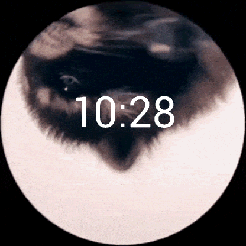

# Garmin Monkey C Watchface App - Venu 2 - Pedro

Welcome to the Garmin Monkey C Watchface - Pedro for Venu 2! This README will guide you through the installation process for the Monkey C extension for VS Code, building the app, and running it with debug.

This application displays "pedro" racoon dancing around you watchface.

## Monkey C Extension for VS Code

To develop Garmin Monkey C watchface apps efficiently, you'll need the Monkey C extension for Visual Studio Code. Follow these steps to install it:

1. Open Visual Studio Code.
2. Go to the Extensions view by clicking on the square icon in the Sidebar or by pressing `Ctrl+Shift+X`.
3. Search for "Monkey C" in the Extensions marketplace.
4. Click **Install** to install the "Monkey C" extension provided by Garmin Ltd.
5. Once installed, you'll have access to Monkey C language support, syntax highlighting, IntelliSense, and more in Visual Studio Code.

## Building the App

1. Press `Ctrl+Shift+B` or open the Command Palette (`Ctrl+Shift+P`) and search for "Monkey C: Build Project".
2. This will compile your Monkey C code into a `.prg` file, ready to be installed on your Garmin Venu 2.

## Running with Debug

Running your Monkey C watchface app with debug capabilities can help you identify and fix issues more efficiently. Here's how to run your app with debug:

1. Connect your Garmin Venu 2 to your computer via USB.
2. Open the Monkey C project folder in Visual Studio Code.
3. Ensure your Monkey C project is open and focused in VS Code.
4. Press `F5` to start debugging or open the Command Palette (`Ctrl+Shift+P`) and search for "Debug: Start Debugging".
5. Your Monkey C watchface app will be installed on your Garmin Venu 2, and you can debug it directly from VS Code.
   
   **Note:** You may need to set breakpoints in your code to pause execution at specific points and inspect variables.

## Additional Resources

For more information on developing Monkey C watchface apps for Garmin devices, refer to the [Garmin Developer Documentation](https://developer.garmin.com/connect-iq/monkey-c/). 

Enjoy building your custom watchface for the Garmin Venu 2! If you encounter any issues, feel free to consult the documentation or reach out to the Garmin developer community for support.